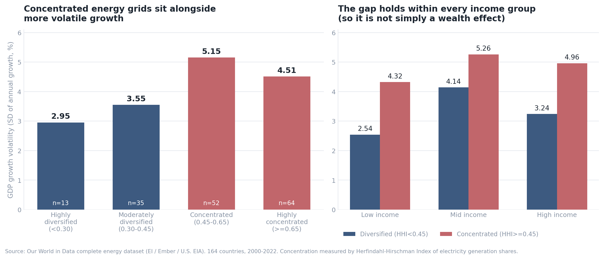

# Energy concentration and growth volatility

**A portfolio-risk measure applied to national electricity mixes, tested against GDP growth volatility across 164 countries, 2000–2022.**

---

## What this is

This is an independent replication, built from raw data, of an established question in energy economics: whether countries that concentrate electricity generation in few sources experience less stable economic growth.

It is not new research. The question has been studied, and the metric used here — a Herfindahl-Hirschman Index applied to energy mix — is the standard tool for it (see *Related work* below). What this project demonstrates is the ability to take a real question, build the measures from raw data rather than borrowing published figures, test the most obvious objection to the result, and state plainly what the analysis does and does not support.

Everything below was derived from the source dataset in SQL. No published estimates were copied.

---

## The question

Diversification is the least controversial idea in finance: spread exposure across imperfectly correlated assets and portfolio volatility falls, without a proportional sacrifice in expected return.

National electricity systems are structurally similar. A country allocates generation across coal, gas, oil, nuclear, hydro, solar, wind and biofuel, and each source carries distinct shocks — fuel price spikes, drought, plant outages, supply-chain and geopolitical disruption. If the portfolio logic transfers, countries drawing on many sources should absorb energy shocks with less damage to output than countries dependent on one.

**Do countries with more diversified electricity generation experience more stable economic growth?**

---

## Related work

This question sits inside an active literature, and it is worth being explicit about where this project stands relative to it.

Energy diversification and its relationship to growth and macroeconomic stability has been studied across country panels, including work constructing dedicated energy diversification indices and testing them across income groups. The specific measure used here — an HHI computed over energy shares, bounded 0 to 1, where higher values indicate greater concentration — is the conventional operationalisation in that literature, including in recent work on OECD economies.

The mechanism is likewise established rather than proposed here: overdependence on few sources exposes economies to energy price volatility, geopolitical disruption and policy shifts, while diversification is understood to improve energy security and dampen price volatility.

**What this project adds is not a new finding.** It reproduces a known relationship independently, on open data, and subjects it to a confounder test — whether the relationship is simply national income in disguise — reporting a null result on that test. The value is in the construction and the honesty of the limitations, not in novelty.

---

## Method

**Data.** [Our World in Data complete energy dataset](https://github.com/owid/energy-data), compiled from Energy Institute, Ember and U.S. EIA sources. One row per country per year. Window 2000–2022, bounded by GDP coverage. Regional aggregates ("Europe", "World", "ASEAN") are excluded by requiring a valid `iso_code`, leaving 164 countries.

**Concentration.** Each country-year receives a Herfindahl-Hirschman Index across eight generation sources: square each fuel's share of electricity, then sum the squares. Squaring is the mechanism — it penalises dominance non-linearly, so a single 65% source contributes far more than five 13% sources totalling the same amount. A simple count of sources, or an average of shares, would not distinguish the two.

- `HHI = 1.00` — one fuel supplies everything
- `HHI = 0.125` — eight fuels at equal share

**Volatility.** The dataset stores GDP levels, not growth rates. Annual growth is derived by joining the table to itself on `(country, year − 1)`. Volatility is then the standard deviation of annual growth per country, computed manually as `sqrt(E[x²] − E[x]²)` since SQLite provides no `STDEV`. Countries with fewer than 15 observed years are excluded, so short series cannot enter the sample appearing stable or unstable by accident.

**Validation.** Both measures were checked against known facts before being used. The most concentrated grid returned is Albania (HHI 1.00, effectively all hydro); the most diversified is Kenya (0.099, a geothermal/hydro/wind/solar mix). The most volatile economies returned are Libya, Equatorial Guinea, Afghanistan, Iraq, Venezuela and Qatar — conflict and oil-price economies. Both measures recover things independently known to be true, which is the cheapest available evidence that they measure what they claim.

---

## Result

Growth volatility rises as electricity generation becomes more concentrated:

| Concentration band | Countries | Growth volatility | Avg growth |
|---|---|---|---|
| Highly diversified (HHI < 0.30) | 13 | **2.95** | 2.77% |
| Moderately diversified (0.30–0.45) | 35 | 3.55 | 3.42% |
| Concentrated (0.45–0.65) | 52 | **5.15** | 4.20% |
| Highly concentrated (HHI ≥ 0.65) | 64 | 4.51 | 4.51% |

Countries in the most diversified band show growth volatility roughly **40% lower** than those in the concentrated band. The pattern is directional but not cleanly monotonic: the most concentrated band is slightly *less* volatile than the band below it, because it contains hydro-dominant and gas-dominant economies that are concentrated yet stable.

**The income objection, tested.** The most obvious challenge is confounding — wealthy countries may simply be both more diversified and more stable, which would make HHI a proxy for income and leave nothing to explain. That is not what the data shows. GDP per capita correlates with growth volatility at **r = 0.002**, effectively zero. Re-tested within income terciles, the gap between diversified and concentrated countries survives in all three:

| Income third | r (HHI, volatility) | Diversified vol. | Concentrated vol. |
|---|---|---|---|
| Low | +0.031 | 2.54 (n=5) | 4.32 (n=49) |
| Mid | +0.042 | 4.14 (n=12) | 5.26 (n=42) |
| High | +0.393 | 3.24 (n=31) | 4.96 (n=25) |

---

## What this supports, and what it does not

The relationship is directionally consistent and survives the confounder most likely to eliminate it. The honest reading is nonetheless a **real but modest** association, not a strong predictive relationship:

- **The linear correlation is weak.** Overall `r = 0.143`. Only the high-income group reaches a moderate `r = 0.393`. Concentration is one input into growth stability, not a dominant one.
- **One cell is too thin to carry weight.** Only 5 low-income countries qualify as diversified. That comparison is suggestive at best and should not be leaned on.
- **Causality is not established, and the reverse story is plausible.** Diversified grids may produce stable growth, or stable capital-rich economies may simply be able to afford diversified grids. Cross-sectional correlation cannot distinguish these. Identifying direction would require within-country variation over time plus an exogenous shock to generation mix — a plant retirement, drought, or import disruption.
- **Commodity exporters confound the concentrated bands.** Several concentrated economies are oil and gas exporters whose growth volatility is driven by export prices rather than grid fragility. These two channels are not separated here.

The defensible claim is narrow: **energy concentration is associated with higher growth volatility; the association is not explained by national income; and the effect is modest rather than dominant.**

---

## Repository contents

| File | Description |
|---|---|
| `energy_diversification_analysis.sql` | Five commented queries: HHI construction, GDP growth self-join, volatility aggregation, the banded comparison, and the income control |
| `diversification_vs_volatility.png` | Results chart |

**SQL used:** self-joins, common table expressions, aggregate functions, `GROUP BY` / `HAVING`, `CASE` bucketing, computed metrics, manual standard deviation, type casting, null handling.

**To reproduce:** download `owid-energy-data.csv` from the source repository, load it into a SQLite table named `energy`, and run the queries in order.

---

## Source

Our World in Data, *Complete Energy Dataset*, compiled from the Energy Institute Statistical Review of World Energy, Ember Yearly Electricity Data, and U.S. Energy Information Administration international energy data.
